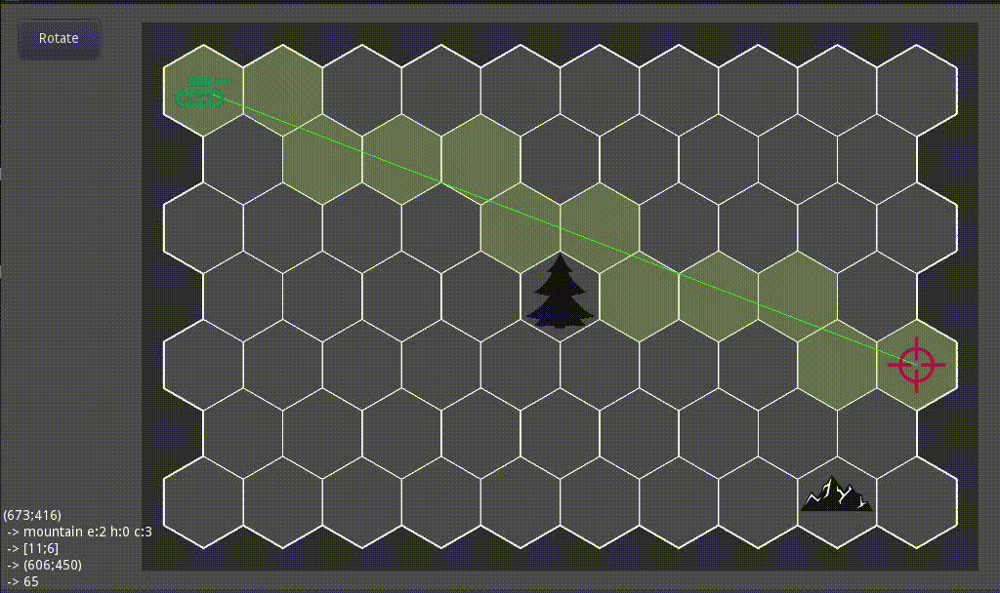
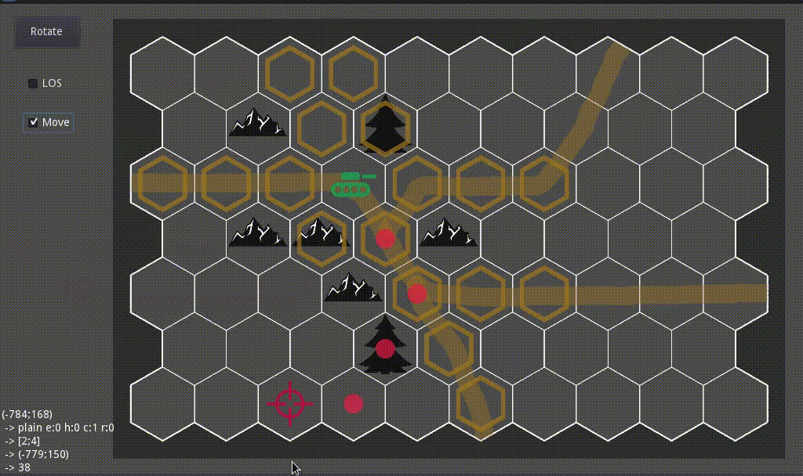
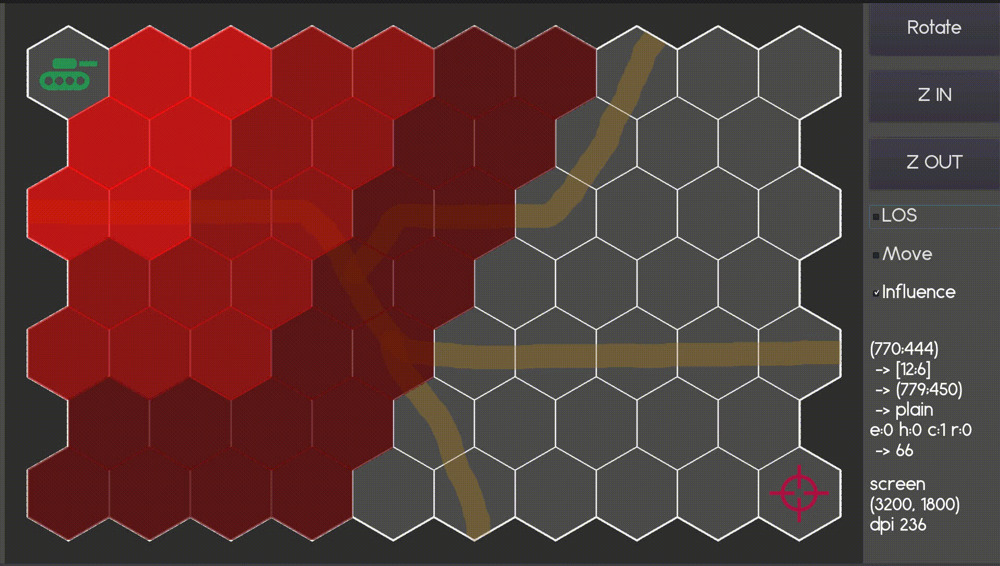

# godot-hexgrid

is a [godot](https://godotengine.org/) based framework to build hex map boardgames.

code is based on [gdx-boardgame](https://github.com/jeremyz/gdx-boardgame),
which is based on [rustanddust](https://github.com/jeremyz/rustanddust).

test maps made with [hexmap](https://github.com/jeremyz/hexmap) a [gimp](https://www.gimp.org) plugin.

## features

    - [x] Distance
    - [x] Adjacents
    - [x] 3D Line Of Sight
    - [x] Reachable Tiles ::: BFS
    - [x] Shortest Path ::: A*
    - [x] Range Of Influence (LOS - Fire Power)
    - [ ] Battle lines (Kruskal + farthest apart units are the flank units)

## screenshots

