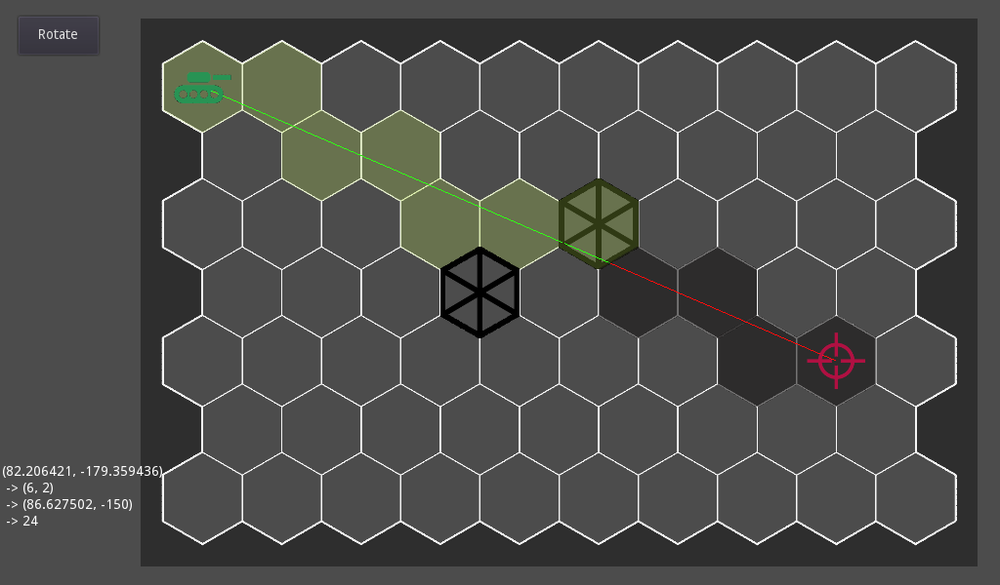

# godot-hexgrid

is a [godot](https://godotengine.org/) based framework to build classical hex boardgames.

code is based on [gdx-boardgame](https://github.com/jeremyz/gdx-boardgame),
which is based on [rustanddust](https://github.com/jeremyz/rustanddust).

base map made with [gimp](https://www.gimp.org) and my plugin [hexmap](https://github.com/jeremyz/hexmap)

## features

    - [x] Distance
    - [x] Adjacents
    - [x] Line Of Sight
    - [ ] Reachable Tiles ::: BFS
    - [ ] Shortest Path ::: A*
    - [ ] Range Of Influence (LOS - Fire Power)
    - [ ] Battle lines (Kruskal + farthest apart units are the flank units)

## screenshots

